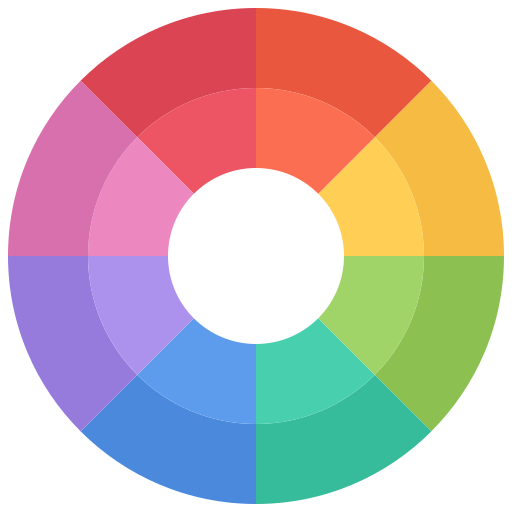

# Tinted Theming: all your themes, everywhere. 

 Style systems and smart build tooling for crafting high fidelity color schemes and easily using them in all your favorite apps.  Originally based on the amazing work of [Chris Kempson](https://github.com/chriskempson/) and his [Base16](https://github.com/chriskempson/base16) system.

**Features**

- Seamless builder support for _multiple_ style systems ([Base16](https://github.com/chriskempson/base16), [Base24](https://github.com/tinted-theming/base24/), etc.)
- Over 230 beautiful and ready-to-use color schemes. [View the Gallery](https://tinted-theming.github.io/base16-gallery).
- Over 70 supported GUI and terminal applications. [See the full list](#supported-applications).
- Allows end users to choose a color scheme and know it will be available _everywhere_.
- Allows color scheme designers to craft a palette of colors once, instantly supporting for many different apps.

## Documentation and Specification

The _builder_ and _styling_ specs detail how to compile _schemes_ and _templates_ into application specific configurations.

### Scheme

A scheme is a fixed palette of named colors and (optionally) instructions for how those colors should be used by apps.

### Style

A style guide provides rules governing how a scheme's palette should be applied within apps.  This means each color is used consistently for similar purposes across all your apps.  Individual styling guides often support different sized pallets and have different ideas about how those colors should be deployed.

See the individual styling guides for more information on each:

- [Base16](/styling.md) - the original, 16 colors with very fixed semantic meanings.
- [Base24](https://github.com/tinted-theming/base24/blob/master/styling.md) - an extra 8  colors for full ANSI support in your terminals.

A scheme is defined using a [YAML](https://yaml.org/) file. The file specification is in the [Builder Guidelines](/builder.md#schemes-repository).

### Builder

A builder is a build tool used by various template repositories to generate files based on scheme file and template file.

- [Builder Guidelines](/builder.md)

### Template

A template describes how a scheme should be transformed to support a specific application.  A template repository defines a template file, then uses a builder to generate application specific files using the template.

Templates often include ready-to-use pre-built versions of every scheme. These are typically installed directly by end users to use the schemes in different applications.

## Supported Applications

Supported applications are applications for which a template exists.

### Official Templates

We maintain a number of templates. Each has been sponsored by at least one project member who is committed to maintaining that template.

We are open to accepting new projects, though they must still be sponsored by a project member and have some level of activity. If a project becomes inactive for more than a year, the repo will be archived as inactive. It can be unarchived if another maintainer steps up.

Editors:

* [Emacs](https://github.com/tinted-theming/base16-emacs) maintained by [belak](https://github.com/belak)
* [Helix](https://github.com/tinted-theming/base16-helix) maintained by [krgn](https://github.com/krgn)
* [JetBrains](https://github.com/tinted-theming/base16-jetbrains) maintained by [adilosa](https://github.com/adilosa), and [JamyGolden](https://github.com/JamyGolden)
* [Kakoune](https://github.com/tinted-theming/base16-kakoune) maintained by [JamyGolden](https://github.com/JamyGolden)
* [VSCode](https://github.com/tinted-theming/base16-vscode) maintained by [golf1052](https://github.com/golf1052)
* [Vim](https://github.com/tinted-theming/base16-vim) maintained by [BonaBeavis](https://github.com/BonaBeavis), and [JamyGolden](https://github.com/JamyGolden)

Terminals:

* [ConEmu](https://github.com/tinted-theming/base16-conemu) maintained by [martinlindhe](https://github.com/martinlindhe)
* [Foot](https://github.com/tinted-theming/base16-foot) maintained by [h4-n1](https://github.com/h4-n1)
* [iTerm2](https://github.com/tinted-theming/base16-iterm2) maintained by [martinlindhe](https://github.com/martinlindhe)
* [PuTTY](https://github.com/tinted-theming/base16-putty) maintained by [benjojo](https://github.com/benjojo)
* [Shell](https://github.com/tinted-theming/base16-shell) (all shells) maintained by [belak](https://github.com/belak), and [JamyGolden](https://github.com/JamyGolden)
* [XFCE Terminal](https://github.com/tinted-theming/base16-xfce4-terminal) maintained by [afq984](https://github.com/afq984)

Other:

* [Dunst](https://github.com/tinted-theming/base16-dunst) maintained by [khamer](https://github.com/khamer)
* [FZF](https://github.com/tinted-theming/base16-fzf) maintained by [JamyGolden](https://github.com/JamyGolden)
* [GTK FlatColor](https://github.com/tinted-theming/base16-gtk-flatcolor) maintained by [Misterio77](https://github.com/Misterio77)
* [i3](https://github.com/tinted-theming/base16-i3) maintained by [khamer](https://github.com/khamer)
* [HexChat](https://github.com/tinted-theming/base16-hexchat) maintained by [JamyGolden](https://github.com/JamyGolden)
* [Polybar](https://github.com/tinted-theming/base16-polybar) maintained by [Misterio77](https://github.com/Misterio77)
* [qutebrowser](https://github.com/tinted-theming/base16-qutebrowser) maintained by [theova](https://github.com/theova)
* [Rofi](https://github.com/tinted-theming/base16-rofi) maintained by [jordiorlando](https://github.com/jordiorlando)
* [Termite](https://github.com/tinted-theming/base16-termite) maintained by [khamer](https://github.com/khamer)
* [Tmux](https://github.com/tinted-theming/base16-tmux) maintained by [mattdavis90](https://github.com/mattdavis90)
* [Wob](https://github.com/tinted-theming/base16-wob) maintained by [h4-n1](https://github.com/h4-n1)
* [Xresources](https://github.com/tinted-theming/base16-xresources) maintained by [DanManN](https://github.com/orgs/tinted-theming/people/DanManN), and [pinpox](https://github.com/orgs/tinted-theming/people/pinpox)
* [Waybar](https://github.com/tinted-theming/base16-waybar) maintained by [laenzlinger](https://github.com/laenzlinger)

### Unofficial Templates

If you have a template you maintain, but don't want to submit it to this org, feel free to add a link to the repository here to add it to this list. These are community maintained templates and may not be updated often.

<b>Terminals</b> - terminal and shell related templates

* [Alacritty](https://github.com/aarowill/base16-alacritty) maintained by [aarowill](https://github.com/aarowill)
* [Blink](https://github.com/niklaas/base16-blink) maintained by [niklaas](https://github.com/niklaas)
* [ConCfg](https://github.com/h404bi/base16-concfg) maintained by [h404bi](https://github.com/h404bi)
* [Console2](https://github.com/AFulgens/base16-console2) maintained by [AFulgens](https://github.com/AFulgens)
* [ConsoleZ](https://github.com/AFulgens/base16-consolez) maintained by [AFulgens](https://github.com/AFulgens)
* [Crosh](https://github.com/philj56/base16-crosh) maintained by [philj56](https://github.com/philj56)
* [fish](https://github.com/tomyun/base16-fish) maintained by [tomyun](https://github.com/tomyun)
* [fish-shell](https://github.com/FabioAntunes/base16-fish-shell) maintained by [FabioAntunes](https://github.com/FabioAntunes)
* [Gnome Terminal](https://github.com/aarowill/base16-gnome-terminal) maintained by [aarowill](https://github.com/aarowill)
* [kermit](https://github.com/orhun/base16-kermit) maintained by [orhun](https://github.com/orhun)
* [kitty](https://github.com/kdrag0n/base16-kitty) maintained by [kdrag0n](https://github.com/kdrag0n)
* [Konsole](https://github.com/cskeeters/base16-konsole) maintained by [cskeeters](https://github.com/cskeeters)
* [MinTTY](https://github.com/geoffstokes/base16-mintty) maintained by [geoffstokes](https://github.com/geoffstokes)
* [st](https://github.com/honza/base16-st) maintained by [honza](https://github.com/honza)
* [Termux](https://github.com/kdrag0n/base16-termux) maintained by [kdrag0n](https://github.com/kdrag0n)
* [Tilix](https://github.com/karlding/base16-tilix) maintained by [karlding](https://github.com/karlding)
* [Windows Terminal](https://github.com/wuqs-net/base16-windows-terminal) maintained by [wuqs-net](https://github.com/wuqs-net)
* [XFCE4 Terminal](https://github.com/afq984/base16-xfce4-terminal) maintained by [afq984](https://github.com/afq984)
* [Xshell](https://github.com/h404bi/base16-xshell) maintained by [h404bi](https://github.com/h404bi)

<b>Editors</b> - templates for use in code editors and IDEs

* [Frescobaldi](https://github.com/rkubosz/base16-frescobaldi) maintained by [rkubosz](https://github.com/rkubosz)
* [Godot](https://github.com/Calinou/base16-godot) maintained by [Calinou](https://github.com/Calinou)
* [gtksourceview3](https://github.com/GarkGarcia/base16-gtksourceview3) maintained by [GarkGarcia](https://github.com/GarkGarcia)
* [JOE](https://github.com/jjjordan/base16-joe) maintained by [jjjordan](https://github.com/jjjordan)
* [Jetbrains IDE](https://github.com/ShiromMakkad/base16-jetbrains-ide) maintained by [ShiromMakkad](https://github.com/ShiromMakkad)
* [Kakoune](https://github.com/leira/base16-kakoune) maintained by [leira](https://github.com/leira)
* [MonoDevelop](https://github.com/netpyoung/base16-monodevelop) maintained by [netpyoung](https://github.com/netpyoung)
* [QOwnNotes](https://github.com/themix-project/base16-template-qOwnNotes) maintained by [themix-project](https://github.com/themix-project)
* [Scide](https://github.com/brunoro/base16-scide) maintained by [brunoro](https://github.com/brunoro)
* [Textadept](https://github.com/rgieseke/base16-textadept) maintained by [rgieseke](https://github.com/rgieseke)
* [Vim-airline](https://github.com/dawikur/base16-vim-airline-themes) maintained by [dawikur](https://github.com/dawikur)
* [Vis](https://github.com/pshevtsov/base16-vis) maintained by [pshevtsov](https://github.com/pshevtsov)
* [vtrgb](https://github.com/coderonline/base16-vtrgb) maintained by [coderonline](https://github.com/coderonline)
* [Xcode](https://github.com/kreeger/base16-xcode) maintained by [kreeger](https://github.com/kreeger)
* [ZOC Terminal](https://github.com/balthild/base16-zoc) maintained by [Balthild](https://github.com/balthild)

<b>Window Managers</b> - window managers and related utilities

* [i3status](https://github.com/Eluminae/base16-i3status) maintained by [Eluminae](https://github.com/Eluminae)
* [i3status-rust](https://github.com/mystfox/base16-i3status-rust) maintained by [mystfox](https://github.com/mystfox)
* [mako](https://github.com/Eluminae/base16-mako) maintained by [Eluminae](https://github.com/Eluminae)
* [qt5ct](https://github.com/mnussbaum/base16-qt5ct) maintained by [mnussbaum](https://github.com/mnussbaum)
* [StumpWM](https://github.com/tpine/base16-stumpwm) maintained by [tpine](https://github.com/tpine)
* [Sway](https://github.com/rkubosz/base16-sway) maintained by [rkubosz](https://github.com/rkubosz)
* [Swaylock](https://git.michaelball.name/gid/base16-swaylock-template) maintained by [michael-ball](https://git.michaelball.name)
* [Window Maker](https://github.com/d-torrance/base16-wmaker) maintained by [d-torrance](https://github.com/d-torrance)
* [Wofi](https://sr.ht/~knezi/base16-wofi) maintained by [knezi](https://sr.ht/~knezi)
* [Wofi colors file](https://github.com/agausmann/base16-wofi-colors) maintained by [agausmann](https://github.com/agausmann)

<b>Programming</b> - defaults and utils for use when programming

* [Binary Ninja](https://github.com/evanrichter/base16-binary-ninja) maintained by [evanrichter](https://github.com/evanrichter)
* [C Header](https://github.com/m1sports20/base16-c_header) maintained by [m1sports20](https://github.com/m1sports20)
* [CSS, Less, Sass/Scss & Stylus](https://github.com/samme/base16-styles) maintained by [samme](https://github.com/samme)
* [GTK+ FlatColor](https://github.com/Misterio77/base16-gtk-flatcolor) maintained by [Misterio77](https://github.com/Misterio77)
* [GTK+2](https://github.com/dawikur/base16-gtk2) maintained by [dawikur](https://github.com/dawikur)
* [Highlight](https://github.com/bezhermoso/base16-highlight) maintained by [bezhermoso](https://github.com/bezhermoso)
* [Highlight.js](https://github.com/highlightjs/base16-highlightjs) maintained by [joshgoebel](https://github.com/joshgoebel)
* [Prism](https://github.com/atelierbram/base16-prism) maintained by [atelierbram](https://github.com/atelierbram)
* [prompt-toolkit & ipython](https://github.com/memeplex/base16-prompt-toolkit) maintained by [memeplex](https://github.com/memeplex)
* [Pygments](https://github.com/mohd-akram/base16-pygments) maintained by [mohd-akram](https://github.com/mohd-akram)
* [Qt Creator](https://github.com/ilpianista/base16-qtcreator) maintained by [ilpianista](https://github.com/ilpianista)

<b>Other</b> - various applications which don't fit in other categories

* [Amfora](https://github.com/jo1gi/base16-amfora) maintained by [jo1gi](https://github.com/jo1gi)
* [Discord](https://github.com/deathbeam/base16-discord) maintained by [deathbeam](https://github.com/deathbeam)
* [LuaKit](https://github.com/twnaing/base16-luakit) maintained by [twnaing](https://github.com/twnaing)
* [PyRadio](https://github.com/edunfelt/base16-pyradio) maintained by [edunfelt](https://github.com/edunfelt)
* [Vimiv](https://github.com/karlch/base16-vimiv) maintained by [karlch](https://github.com/karlch)
* [Windows Command Prompt](https://github.com/iamthad/base16-windows-command-prompt) maintained by [iamthad](https://github.com/iamthad)
* [zathura](https://github.com/HaoZeke/base16-zathura) maintained by [HaoZeke](https://github.com/HaoZeke)

### Adding Support for a New Application

To add your own template, submit a pull request to this repository to add your repository to the "Unofficial Templates" list below in the relevant category.

**Recommended repository naming scheme: [style-name]-[template-name]** (with dashes as separators).

## Schemes

To add a Base16 scheme, simply submit a pull request to the [base16-schemes repo](https://github.com/tinted-theming/base16-schemes) and add your scheme.

## Builders

Normally end-users should not need to use builders, as they're primarily meant for maintainers - both scheme and template maintainers. These are tools used to build templates with all the currently submitted schemes.

Spec changes will not be released until there is consensus among maintainers and at least one builder with a pull request ready for implementing that spec version.

See the [CHANGELOG](/CHANGELOG.md) for more information about changes in the
spec.

* [Base16 Builder Go](https://github.com/tinted-theming/base16-builder-go) maintained by [belak](https://github.com/belak) - currently supports 0.11.0
* [Base16 Builder Node](https://github.com/tinted-theming/base16-builder-node) maintained by [joshgoebel](https://github.com/joshgoebel) - currently supports 0.10.0

## Scheme and Template Author Resources

The following is a list of useful resources for anyone creating a Base16 scheme and or template:

* [TmTheme Editor](http://tmtheme-editor.herokuapp.com) - An online editor for themes in tmTheme format.
* [Base16 Template Converter](https://github.com/ntpeters/base16-template-converter) - A script to automatically convert Base16 templates written in the old Embedded Ruby style to the new Mustache style.

## Tools

If you've written a tool feel free to add it to the list below:

* [auto-base16-theme](https://github.com/makuto/auto-base16-theme) - A command line tool to create a base16 theme from an input image's color palette.
* [base16-manager](https://github.com/AuditeMarlow/base16-manager) - A command line tool to install base16 templates and set themes globally.
* [base16-shell-preview](https://github.com/nvllsvm/base16-shell-preview) - A command line tool to preview and set base16-shell themes.
* [base16-universal-manager](https://github.com/binaryplease/base16-universal-manager) - A command line tool to automatically get, build and set base16 themes globally for *all* supported applications. Themes and templates are pulled form the official repositories or from a local cache.
* [flavours](https://github.com/misterio77/flavours) - A command line tool to manage and globally apply base16 templates by specifying a scheme name.
* [Themix/Oomox](https://github.com/themix-project/oomox/) - Graphical application for generating different color variations of a Arc, Materia and Oomox themes (GTK2, GTK3 and others), Archdroid, Gnome-Colors and Numix icons, and terminal palette. Base16 plugin allows to open Base16 YAML files a export both Base16 and its own themes using Base16 Mustache templates.
* [base16-spectrum-generator](https://github.com/alexmirrington/base16-spectrum-generator) - A Python script for generating `.png` files showcasing the colours in a base16 theme.
* [base16.nix](https://github.com/SenchoPens/base16.nix) - a NixOS / home-manager module to set base16 / base24 schemes and use templates.

## Projects

* [Visual Studio Code](https://code.visualstudio.com) - Code Editor
* [Atom Editor](https://atom.io) - Code Editor
* [c-Tiles16](https://github.com/atelierbram/c-tiles16) - Colorscheming with Variables.
* [Spacegray](https://github.com/kkga/spacegray) - A set of custom UI themes for Sublime Text 2/3.
* [Harmonic16](http://janniks.github.io/harmonic16) - A color generator for harmonic Base16 color-schemes.
* [Duotone-base16](https://github.com/davidosomething/duotone-base16) - A Duotone scheme to Base16 convertor.
* [terminal.sexy](https://terminal.sexy) - Terminal Color Scheme Designer
* [Just-Colors](https://github.com/andreyvpng/just-colors) - Simple configuration file generator
* [Highlight.js](https://highlightjs.org) - JavaScript syntax highlighter
* [nix-colors](https://github.com/Misterio77/nix-colors) - Designed to help with Nix(OS) theming.

## Non-template Themes

* [base16-mutt](https://github.com/josephholsten/base16-mutt) - a config file for mutt which uses base16 colors from the terminal

## Project Chat

Have something you want to discuss, but you're not sure it warrants an issue? Feel free to stop by
[#tinted-theming:matrix.org](https://matrix.to/#/#tinted-theming:matrix.org) on [Matrix](https://matrix.org/).

## Credits

- Thanks to [Chris Kempson](https://github.com/chriskempson) for the original concept and implementation.
- Color wheel icon thanks to [Color icons created by Nikita Golubev - Flaticon](https://www.flaticon.com/free-icons/color).
