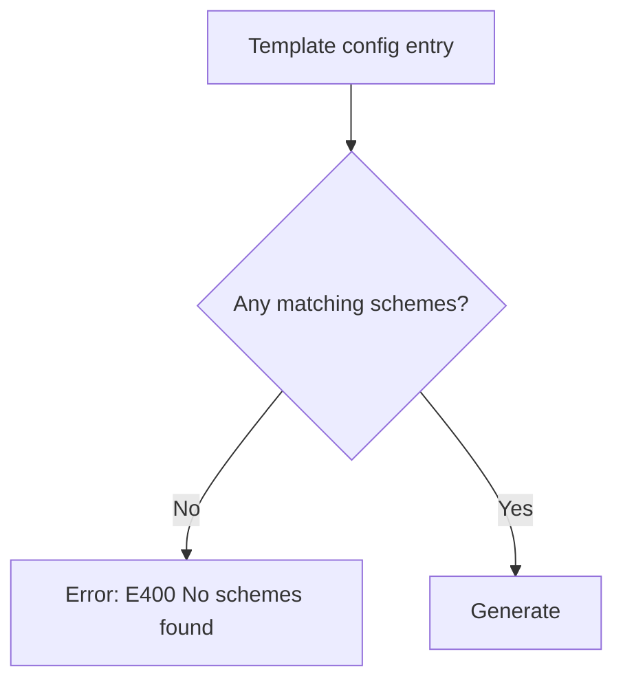

# Tinted8 Builder Guidelines

**Version 0.2.0-beta3** The latest version of this spec can be obtained from
[tinted-theming/specs/tinted8/builder]

## Introduction

Builders convert a Tinted8 scheme into color data for templates to generate
themes.

## Inputs

### Scheme Inputs

Builders read scheme files that conform to the Styling specification. At
minimum they must provide:

- Required: `scheme.system`, `scheme.author`, `variant`, `palette`
- Partially required: At least one of `scheme.name`, `scheme.slug` or `scheme.family`
- Optional: `syntax`, `ui`, `scheme.style`, `scheme.theme-author`, `scheme.description`

All color values must be HTML-style hex (`#RRGGBB`).

### Template Input

```
/templates/config.yaml
/templates/*.mustache
```

`config.yaml` describes which systems the template supports and how output
filenames are constructed. Builders read these values to generate consistent
output paths.

## Name and Slug Handling

If a scheme lacks a `slug`, builders derive one by slugifying the `name`:

- Normalize Unicode to ASCII
- Lowercase all letters
- Replace spaces with `-`
- Remove non-alphanumeric, non-dash characters

Examples: 

- `Catppuccin Mocha` → `catppuccin-mocha`
- `Rosé Pine` → `rose-pine`
- `Default (Dark)` → `default-dark`

## Palette Expansion

### Variants

For every `palette.{{token_name}}`, if the color is missing, the builder generates:

- `normal` - The color as provided (e.g. `red.normal`)
- `bright` - A lighter variant (e.g. `cyan.bright`)
- `dim` - A darker variant (e.g `green.dim`)

If the scheme provides `palette.{{color_name}}.bright` or
`palette.{{color_name}}.dim` color variants, builders must not override them
and should skip derivation for that color.

### Derived Colors (when missing)

Supplemental colors are generated if they aren't provided in the scheme itself.
If a color is present in the scheme palette it must be used as-is; otherwise it
is derived using the formulas below:

- `gray` - The midpoint between `palette.black` and `palette.white`.
- `orange` - A hue-shifted variant of `palette.yellow`.
- `brown` - A darker, desaturated variant derived from `palette.yellow`.

### Naming

Each produced value is exposed as with color sub-components:

```
{{token-name}}-{{variant}}-{{sub-component}}
```

```
blue.bright.hex  → "7cafc2"
red.normal.rgb.r → "124"
green.dim.dec.b  → "0.76"
```

## Color Formulas

This section defines the normative color conversion rules builders must apply
when deriving supplemental colors and generating `bright`/`dim` variants. Unless
stated otherwise, conversions operate in HSL with channel ranges `S, L ∈ [0,1]`
and hue in degrees `h ∈ [0, 360)`.

- Clamp: `clamp(x, lo, hi) = min(max(x, lo), hi)`; builders must clamp `S` and
  `L` after each operation to remain in-range.
- Hue wrap: add/subtract in degrees and wrap with `(h + 360) % 360`.

### Derived Colors (when missing)

- orange from yellow
  - Input: `h, s, l = HSL(palette.yellow)`
  - Operation: `h' = (h - 10) mod 360`, `s' = s`, `l' = l`
  - Output: `HSL(h', s', l')` converted back to RGB/hex

- brown from yellow
  - Input: `h, s, l = HSL(palette.yellow)`
  - Operation: `h' = (h - 15) mod 360`, `s' = clamp(s * 0.65, 0, 1)`, `l' = clamp(l - 0.30, 0, 1)`
  - Output: `HSL(h', s', l')` converted back to RGB/hex

- gray from black and white
  - Input: `HSL(black) = (h_b, s_b, l_b)`, `HSL(white) = (h_w, s_w, l_w)`
  - Operation:
    - Hue midpoint (wrap-aware): `d = ((h_b - h_w + 540) % 360) - 180`, `h' = (h_w + 0.5*d + 360) % 360`
    - Saturation: `s' = 0`
    - Lightness: `l' = 0.5 * (l_b + l_w)`
  - Output: `HSL(h', s', l')` converted back to RGB/hex

If the scheme provides any of `orange`, `brown` or `gray`, builders must not
override them and should skip derivation for that color.

### Variant Generation (bright/dim)

Builders must derive missing `bright` and `dim` from the `normal` variant of
each palette color using the following HSL adjustments, leaving the hue
unchanged.

- Constants: `ΔL = 0.12`

- dim
  - Given `HSL(h, s, l)`:
  - Lightness: `l' = clamp(l - min(ΔL, l), 0, 1)`
  - Saturation boost factor `k_dim(l)`:
    - if `l < 0.4` → `k = 1.04`
    - else if `l < 0.7` → `k = 1.07`
    - else → `k = 1.10`
  - Saturation: `s' = clamp(s * k, 0, 1)`

- bright
  - Given `HSL(h, s, l)`:
  - Lightness: `l' = clamp(l + min(ΔL, 1 - l), 0, 1)`
  - Saturation factor `k_bright(l)`:
    - if `l < 0.5` → `k = 1.08`
    - else if `l < 0.8` → `k = 1.00`
    - else → `k = 0.90`
  - Saturation: `s' = clamp(s * k, 0, 1)`

These rules ensure consistent perceived contrast between `normal`, `dim`, and
`bright` variants while avoiding out-of-gamut values.

## Template Variables

### Meta Variables

Meta variables exist under the `scheme` mustache variable object.

| Variable                           | Type    | Description                                               |
| ---------------------------------- | ------- | --------------------------------------------------------- |
| `scheme.system`                    | String  | Scheme system                                             |
| `scheme.supported-styling-version` | String  | Supported tinted8 styling spec                            |
| `scheme.supported-builder-version` | String  | Supported tinted8 builder spec                            |
| `scheme.name`                      | String  | `name`                                                    |
| `scheme.family`                    | String  | `family`                                                  |
| `scheme.style`                     | String  | `style`                                                   |
| `scheme.author`                    | String  | `author`                                                  |
| `scheme.theme-author`              | String  | `theme-author`                                            |
| `scheme.description`               | String  | `description`                                             |
| `scheme.slug`                      | String  | `slug` or slugified `name` seperated by hiphens (`-`)     |
| `scheme.slug-underscored`          | String  | `slug` or slugified `name` seperated by underscores (`_`) |

### Option Variables

Option variables exist under the `option` mustache variable object.

| Variable                           | Type    | Description              |
| ---------------------------------- | ------- | ------------------------ |
| `option.is-dark-variant`           | Boolean | Based on `variant` value | 

### Color Variables

`syntax` and `ui` properties will be referred to as "Theming Properties".

The builder provides various color variables for every `palette` token variant
(`normal`, `bright`, `dim`) and every Theming Property.

The variable suffixes are as follows:

- `{{token-name}}.hex` - 6-digit hex color value (e.g "7cafc2")
- `{{token-name}}.hex-<r|g|b>` - Provides a R, G or B hex color value (e.g "7c")
- `{{token-name}}.hex-bgr` - A reversed version of all the hex values (e.g "c2af7c")
- `{{token-name}}.rgb.<r|g|b>` - Provides a R, G or B color value between `0` and `255` (e.g. "124")
- `{{token-name}}.dec.<r|g|b>` - Provides a R, G or B decimal value between `0` and `1` (e.g. "0.4863")
- `{{token-name}}.rgb16.<r|g|b>` - Provides a R, G or B 16 bit value between `0` and `65_535` (e.g. "15000")

Values omit the leading `#` for hex strings.

### Theming Properties

For every recognized `syntax` and `ui` key from the Styling spec, builders
provide equivalent template variables, for example:

```
syntax.comment.hex
syntax.string.dec.r
ui.global.background.rgb16.b
```

#### Parent Keys and the `.default` Suffix

In Mustache, theming property keys that have children (e.g., `syntax.comment`
which contains `syntax.comment.line`, `syntax.comment.block`, etc.) are exposed
as objects. To access the color value of the parent key itself, use the
`.default` suffix:

```
syntax.comment.default.hex       → color value for "comment" scope
syntax.comment.line.hex          → color value for "comment.line" scope
syntax.string.quoted.default.hex → color value for "string.quoted" scope
```

Leaf keys (those without children) do not require the `.default` suffix:

```
syntax.string.regexp.hex     → color value for "string.regexp" scope
syntax.constant.language.hex → color value for "constant.language" scope
```

Each corresponds either to:

1. The explicit values set in the scheme
1. Its inherited parent
1. The builder's default color token

## Theme Resolution

Resolution order:

1. Explicit scheme Theming Property - exact key value (e.g. `syntax.diff.added`)
1. Inherited Theming Property - parent group value (e.g. `syntax.diff`)
1. Builder default - mapped palette token (e.g. `green_bright`)

Builders must ensure all Theming Properties resolve to a valid color.

### Builder Default Colors

The default table below lists colors for the `dark` variant. When generating a
`light` variant, builders must mirror any default that uses `black`, `gray` or
`white` through the following luminance scale:

| Index | Color          |
| ----- | -------------- |
| 0     | `black-dim`    |
| 1     | `black-normal` |
| 2     | `black-bright` |
| 3     | `gray-dim`     |
| 4     | `gray-normal`  |
| 5     | `gray-bright`  |
| 6     | `white-dim`    |
| 7     | `white-normal` |
| 8     | `white-bright` |

To convert a dark default to its light equivalent, mirror the index:
`light_index = 8 - dark_index`. For example, `black-bright` (index 2)
becomes `white-dim` (index 6), and `gray-dim` (index 3) becomes `gray-bright`
(index 5). Colors that are not `black`, `gray` or `white` remain unchanged
between variants.

| Theming Property                         | Dark Default Color  | Light Default Color  |
| ---------------------------------------- | ------------------- | -------------------- |
| syntax.comment                           | gray-dim            | gray-bright          |
| syntax.comment.line                      | gray-dim            | gray-bright          |
| syntax.comment.block                     | gray-dim            | gray-bright          |
| syntax.comment.documentation             | gray-dim            | gray-bright          |
| syntax.invalid                           | red-bright          | red-bright           |
| syntax.invalid.deprecated                | yellow-bright       | yellow-bright        |
| syntax.invalid.illegal                   | red-bright          | red-bright           |
| syntax.string                            | green-normal        | green-normal         |
| syntax.string.quoted                     | green-normal        | green-normal         |
| syntax.string.quoted.single              | green-normal        | green-normal         |
| syntax.string.quoted.double              | green-normal        | green-normal         |
| syntax.string.regexp                     | red-normal          | red-normal           |
| syntax.string.template                   | green-normal        | green-normal         |
| syntax.string.interpolated               | green-normal        | green-normal         |
| syntax.string.unquoted                   | green-normal        | green-normal         |
| syntax.string.other                      | green-normal        | green-normal         |
| syntax.constant                          | orange-normal       | orange-normal        |
| syntax.constant.numeric                  | orange-normal       | orange-normal        |
| syntax.constant.numeric.integer          | orange-normal       | orange-normal        |
| syntax.constant.numeric.float            | orange-normal       | orange-normal        |
| syntax.constant.numeric.hex              | orange-normal       | orange-normal        |
| syntax.constant.language                 | orange-normal       | orange-normal        |
| syntax.constant.character                | orange-normal       | orange-normal        |
| syntax.constant.character.escape         | orange-normal       | orange-normal        |
| syntax.constant.character.entity         | orange-normal       | orange-normal        |
| syntax.constant.other                    | orange-normal       | orange-normal        |
| syntax.entity                            | white-normal        | black-normal         |
| syntax.entity.name                       | white-normal        | black-normal         |
| syntax.entity.name.class                 | yellow-normal       | yellow-normal        |
| syntax.entity.name.function              | blue-normal         | blue-normal          |
| syntax.entity.name.function.constructor  | blue-normal         | blue-normal          |
| syntax.entity.name.label                 | white-normal        | black-normal         |
| syntax.entity.name.tag                   | white-normal        | black-normal         |
| syntax.entity.name.type                  | cyan-normal         | cyan-normal          |
| syntax.entity.name.type.class            | cyan-normal         | cyan-normal          |
| syntax.entity.name.type.enum             | cyan-normal         | cyan-normal          |
| syntax.entity.name.namespace             | yellow-normal       | yellow-normal        |
| syntax.entity.name.section               | cyan-normal         | cyan-normal          |
| syntax.entity.other                      | white-normal        | black-normal         |
| syntax.entity.other.attribute-name       | magenta-normal      | magenta-normal       |
| syntax.entity.other.inherited-class      | white-normal        | black-normal         |
| syntax.keyword                           | magenta-normal      | magenta-normal       |
| syntax.keyword.control                   | magenta-normal      | magenta-normal       |
| syntax.keyword.control.import            | magenta-normal      | magenta-normal       |
| syntax.keyword.control.flow              | magenta-normal      | magenta-normal       |
| syntax.keyword.declaration               | magenta-normal      | magenta-normal       |
| syntax.keyword.operator                  | magenta-normal      | magenta-normal       |
| syntax.keyword.other                     | magenta-normal      | magenta-normal       |
| syntax.storage                           | magenta-normal      | magenta-normal       |
| syntax.storage.type                      | magenta-normal      | magenta-normal       |
| syntax.storage.modifier                  | magenta-normal      | magenta-normal       |
| syntax.support                           | blue-normal         | blue-normal          |
| syntax.support.function                  | blue-normal         | blue-normal          |
| syntax.support.class                     | blue-normal         | blue-normal          |
| syntax.support.type                      | blue-normal         | blue-normal          |
| syntax.support.constant                  | magenta-normal      | magenta-normal       |
| syntax.support.variable                  | cyan-normal         | cyan-normal          |
| syntax.support.other                     | blue-normal         | blue-normal          |
| syntax.support.function.builtin          | blue-bright         | blue-bright          |
| syntax.variable                          | white-normal        | black-normal         |
| syntax.variable.parameter                | cyan-bright         | cyan-bright          |
| syntax.variable.language                 | magenta-normal      | magenta-normal       |
| syntax.variable.other                    | white-normal        | black-normal         |
| syntax.variable.other.constant           | white-normal        | black-normal         |
| syntax.variable.other.property           | white-normal        | black-normal         |
| syntax.variable.other.object             | white-normal        | black-normal         |
| syntax.punctuation                       | white-dim           | black-bright         |
| syntax.punctuation.separator             | white-normal        | black-normal         |
| syntax.punctuation.definition            | white-normal        | black-normal         |
| syntax.punctuation.definition.string     | green-normal        | green-normal         |
| syntax.punctuation.definition.comment    | gray-dim            | gray-bright          |
| syntax.punctuation.section               | orange-normal       | orange-normal        |
| syntax.markup                            | orange-normal       | orange-normal        |
| syntax.markup.bold                       | orange-normal       | orange-normal        |
| syntax.markup.italic                     | orange-normal       | orange-normal        |
| syntax.markup.quote                      | orange-normal       | orange-normal        |
| syntax.markup.underline                  | orange-normal       | orange-normal        |
| syntax.markup.heading                    | magenta-normal      | magenta-normal       |
| syntax.markup.list                       | orange-normal       | orange-normal        |
| syntax.markup.list.numbered              | cyan-normal         | cyan-normal          |
| syntax.markup.list.unnumbered            | cyan-normal         | cyan-normal          |
| syntax.markup.link                       | yellow-normal       | yellow-normal        |
| syntax.markup.raw                        | orange-normal       | orange-normal        |
| syntax.markup.inserted                   | green-bright        | green-bright         |
| syntax.markup.changed                    | yellow-bright       | yellow-bright        |
| syntax.markup.deleted                    | red-bright          | red-bright           |
| syntax.source                            | white-normal        | black-normal         |
| syntax.text                              | white-normal        | black-normal         |
| syntax.meta                              | white-normal        | black-normal         |
| syntax.meta.annotation                   | orange-normal       | orange-normal        |
| syntax.meta.function                     | white-normal        | black-normal         |
| syntax.meta.class                        | white-normal        | black-normal         |
| syntax.meta.block                        | white-normal        | black-normal         |
| syntax.meta.tag                          | white-normal        | black-normal         |
| syntax.meta.type                         | white-normal        | black-normal         |
| syntax.meta.import                       | white-normal        | black-normal         |
| syntax.meta.preprocessor                 | white-normal        | black-normal         |
| syntax.meta.embedded                     | white-normal        | black-normal         |
| syntax.meta.object                       | orange-normal       | orange-normal        |
| ui.global.background.normal              | black-normal        | white-normal         |
| ui.global.background.dark                | black-dim           | white-bright         |
| ui.global.background.light               | black-bright        | white-dim            |
| ui.deprecated                            | brown-normal        | brown-normal         |
| ui.accent                                | cyan-normal         | cyan-normal          |
| ui.border                                | gray-dim            | gray-bright          |
| ui.cursor.normal                         | white-normal        | black-normal         |
| ui.cursor.muted                          | gray-bright         | gray-dim             |
| ui.global.foreground.normal              | white-normal        | black-normal         |
| ui.global.foreground.dark                | white-dim           | black-bright         |
| ui.global.foreground.light               | white-bright        | black-dim            |
| ui.gutter.background                     | black-normal        | white-normal         |
| ui.gutter.foreground                     | white-dim           | black-bright         |
| ui.highlight.line.background             | gray-dim            | gray-bright          |
| ui.highlight.line.foreground             | white-dim           | black-bright         |
| ui.link                                  | cyan-normal         | cyan-normal          |
| ui.highlight.search.background           | black-bright        | white-dim            |
| ui.highlight.search.foreground           | yellow-normal       | yellow-normal        |
| ui.highlight.text.background             | gray-dim            | gray-bright          |
| ui.highlight.text.foreground             | white-normal        | black-normal         |
| ui.highlight.text.active-background      | gray-normal         | gray-normal          |
| ui.highlight.text.active-foreground      | white-normal        | black-normal         |
| ui.highlight.button.background           | black-bright        | white-dim            |
| ui.highlight.button.foreground           | white-normal        | black-normal         |
| ui.indent-guide.background               | black-bright        | white-dim            |
| ui.indent-guide.active-background        | gray-dim            | gray-bright          |
| ui.selection.background                  | black-bright        | white-dim            |
| ui.selection.foreground                  | white-normal        | black-normal         |
| ui.selection.inactive-background         | black-bright        | white-dim            |
| ui.status.error                          | red-normal          | red-normal           |
| ui.status.warning                        | yellow-normal       | yellow-normal        |
| ui.status.info                           | orange-normal       | orange-normal        |
| ui.status.success                        | green-normal        | green-normal         |
| ui.tooltip.background                    | black-dim           | white-bright         |
| ui.tooltip.foreground                    | white-normal        | black-normal         |
| ui.whitespace.foreground                 | gray-normal         | gray-normal          |

## Output and Template Config

Builders apply template configuration as follows:

- Respect `supported-systems`
- Generate output filenames according to the `filename` template (with
  available variables)
- Avoid name collisions
- Write rendered templates relative to the repository root

Example `config.yaml`:

```yaml
default:
  filename: "output/{{ scheme-system }}-{{ scheme-slug }}.ext"
  supported-systems: [tinted8]
```

## Version and Specification Support

Tinted8 builders must declare and validate the specification versions they support
to ensure compatibility across the Styling and Builder specifications.

### Support Declaration

Every builder **must expose** a `supports` object, either in its configuration or
metadata output, with the following fields in the `templates/config.yaml`:

```yaml
default:
  filename: "output/{{ scheme-system }}-{{ scheme-slug }}.ext"
  supported-systems: [tinted8]
  supports:
    tinted8-styling: ">=0.1.0"
    tinted8-builder: ">=0.1.0"
```

This defines which versions of the Tinted8 Styling and Builder specifications
are implemented and guaranteed compatible. All `supports` object property
values must follow semantic versioning rules ([semver]).

### Enforcement

When loading a scheme file, the builder must check that:

1. The scheme's declared system matches "tinted8".
1. The scheme's spec version (if provided) satisfies the builder's
   `supports.tinted8-styling` range.
1. The builder's own implementation version satisfies its declared
   `supports.tinted8-builder` range.

If any of these checks fail, the builder must emit an error and refuse to
process the scheme until the version mismatch is resolved.

### Validation Stages

Validation runs in four stages to simplify troubleshooting. Each stage maps to
the error code ranges below:

- Scheme Intake & System Validation (E1xx): read file, parse YAML, validate scheme system. E001 is part of this stage.
- Spec Compatibility (E2xx): verify spec-version compatibility.
- Template Configuration (E3xx): ensure `tinted8` configs declare the required `supports` and templates.
- Build-Time Selection/Generation (E4xx): ensure at least one scheme matches the config.

#### Intake Flow (E1xx)

```mermaid
flowchart TD
  A[Scheme file] --> B{Valid extension?}
  B --> |No| E[Error: E111 Invalid scheme file]
  B --> |Yes| C{YAML parses?}
  C --> |No| F[Error: E112 Deserialization error]
  C --> |Yes| D{Known scheme system?}
  D --> |No| G[Error: E110 Unknown/unsupported system]
  D --> |Yes| I{system == "tinted8"?}
  I --> |No| J[Error: E001 Invalid system]
  I --> |Yes| K[Proceed to E2xx]
```

#### Compatibility Flow (E2xx)

```mermaid
flowchart TD
  A[Scheme (tinted8)] --> C{tinted8-styling within supported range?}
  C --> |No| F[Error: E002 Unsupported Tinted8 Styling Spec]
  C --> |Yes| D{tinted8-builder self-version within supported range?}
  D --> |No| G[Error: E003 Tinted8 Builder Spec Incompatible]
  D --> |Yes| H[Proceed to E3xx]
```

#### Template Config Flow (E3xx)

```mermaid
flowchart TD
  A[templates/config.yaml] --> B{targets tinted8?}
  B --> |No| H[Proceed (other systems)]
  B --> |Yes| C{supports block present?}
  C --> |No| E[Error: E300 Missing supports]
  C --> |Yes| D{tinted8-styling entry present?}
  D --> |No| F[Error: E301 Missing supports.tinted8-styling]
  D --> |Yes| I{tinted8-builder entry present?}
  I --> |No| J[Error: E302 Missing supports.tinted8-builder]
  I --> |Yes| K{mustache template exists?}
  K --> |No| L[Error: E303 Mustache template missing]
  K --> |Yes| M{valid filename config?}
  M --> |No| N[Error: E304 Invalid filename configuration]
  M --> |Yes| O[Proceed to E4xx]
```

#### Build Selection Flow (E4xx)



#### Rationale

This ensures:

- Builders only build versions they are designed for, which will reduce builder generation bugs
- Builders will have backward compatibility built into them for both the builder and styling specifications
- Authors can easily identify compatibility issues
- Downstream tools (editors, integrations) can introspect supported specs programmatically

#### Error Code Design

Error codes are segmented by lifecycle stage to make them scannable and extensible. Legacy
compatibility is preserved by keeping `E001`–`E003` unchanged.

- E1xx — Scheme Intake & System Validation (includes `E001`)
- E2xx — Spec Compatibility
- E3xx — Template Configuration
- E4xx — Build-Time Selection/Generation

Note: The intake flow shows `E001` at the first gate; although it appears in the compatibility diagram, it belongs to the E1xx intake stage.

#### Error Groups

Messages MAY include file paths or version ranges for clarity.

#### Scheme Intake

| Code   | Description                                                                                  |
| ------ | -------------------------------------------------------------------------------------------- |
| `E001` | Invalid system.                                                                              |
| `E110` | Unknown or unsupported scheme system in input.                                               |
| `E111` | Invalid scheme file (bad extension or missing required fields like `system`/`scheme.system`).|
| `E112` | Scheme deserialization error (malformed YAML or incompatible structure).                     |

#### Compatibility Checks

| Code   | Description                                                        |
| ------ | ------------------------------------------------------------------ |
| `E002` | Scheme requires unsupported Tinted8 Styling spec version.          |
| `E003` | Builder version not compatible with declared Tinted8 Builder spec. |

#### Template Config

| Code   | Description                                                                                            |
| ------ | ------------------------------------------------------------------------------------------------------ |
| `E300` | Missing `supports` block when `supported-systems` includes `tinted8`.                                  |
| `E301` | Missing `supports.tinted8-styling` entry in template config for `tinted8`.                             |
| `E302` | Missing `supports.tinted8-builder` entry in template config for `tinted8`.                             |
| `E303` | Mustache template missing for a config entry (e.g. `templates/<name>.mustache`).                       |
| `E304` | Invalid filename configuration: provide `filename` or use deprecated `extension`/`output` combination. |
| `E305` | Template config missing or invalid YAML.                                                               |

#### Build-Time Selection

| Code   | Description                                      |
| ------ | ------------------------------------------------ |
| `E400` | No schemes found for a template config entry.    |

## Compliance

A builder is considered **Tinted8-compliant** if it:

- Correctly reads Tinted8 scheme files
- Expands all palette and Theming Properties
- Provides consistent variable naming for templates
- Generates derived colors as described above

## Design Considerations

Tinted8 builders are encouraged to:

- Maintain perceptual contrast between bright/dim variants
- Preserve hue relationships when computing derived colors
- Cache computed variables for performance
- Provide clear error messages for missing or invalid fields

## Considerations

Mustache was chosen as the templating language due to its simplicity and
widespread adoption across languages. YAML was chosen to describe scheme and
configuration files for similar reasons.

The other Tinted Theming scheme systems also use Mustache and YAML, making it a
consistent choice.

## References

- Tinted8 Styling Specification v0.1.0-draft
- Mustache Template Language Specification

_SPEC END_

---

[tinted-theming/specs/tinted8/builder]: https://github.com/tinted-theming/home/blob/main/specs/tinted8/builder.md
[semver]: https://semver.org/
