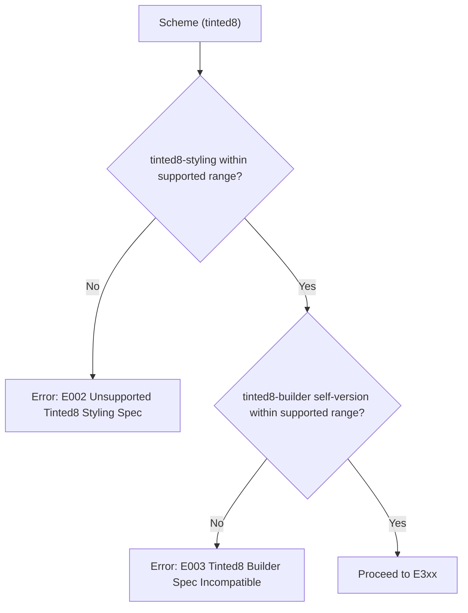
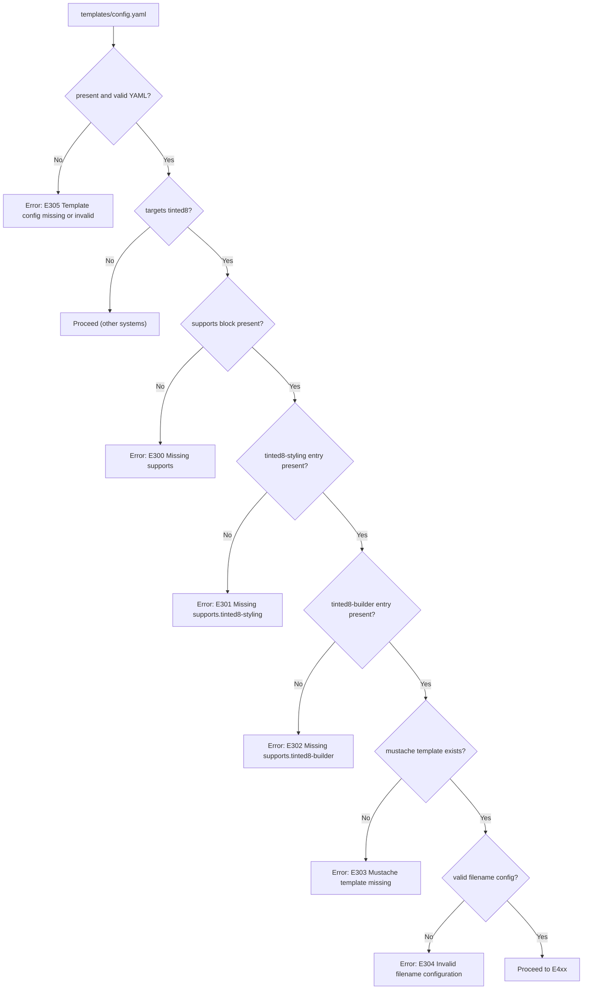
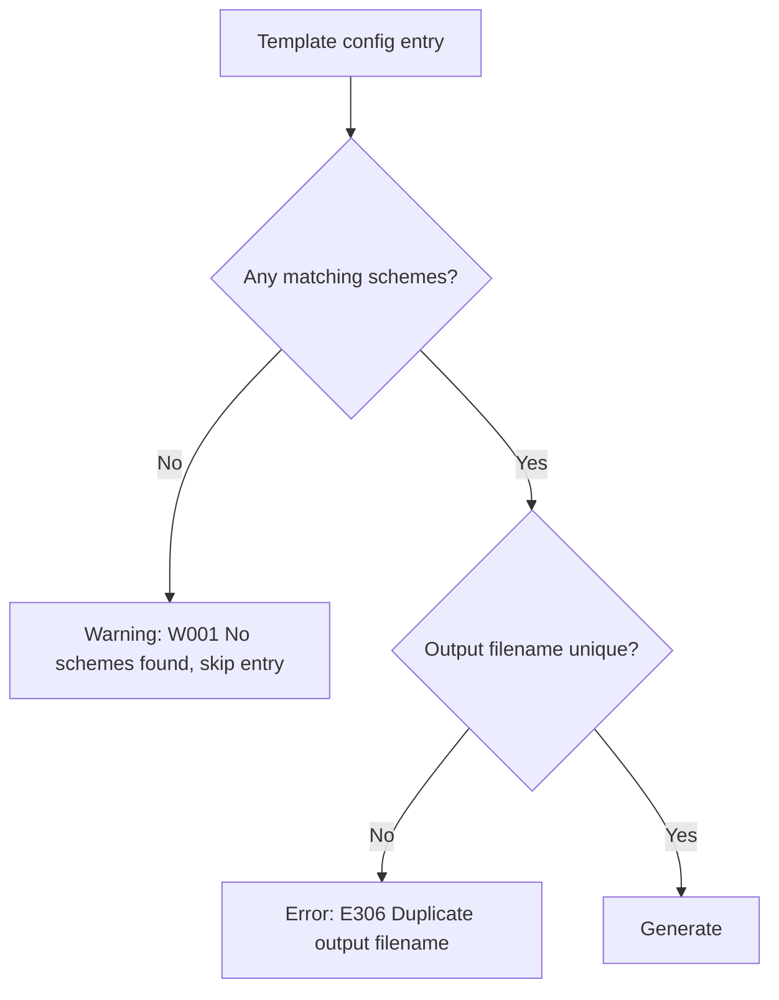

# Tinted8 Builder Guidelines

**Version 0.2.0-beta11** The latest version of this spec can be obtained from
[tinted-theming/specs/tinted8/builder]

## Introduction

Builders convert a Tinted8 scheme into color data for templates to generate
themes.

## Inputs

### Scheme Inputs

Builders read scheme files that conform to the Styling specification. At
minimum they must provide:

- Required: `scheme.system`, `scheme.supports.styling-spec`, `scheme.author`,
  `variant`, `palette`
- Partially required: At least one of `scheme.name`, `scheme.slug` or
  `scheme.family`
- Optional: `syntax`, `ui`, `scheme.style`, `scheme.theme-author`,
  `scheme.description`

All color values must be HTML-style hex (`#RRGGBB`). Builders must accept both
uppercase and lowercase hex digits on input, and must emit lowercase hex in all
generated template variables.

### Template Input

```
/templates/config.yaml
/templates/*.mustache
```

`config.yaml` describes which systems the template supports and how output
filenames are constructed. Builders read these values to generate consistent
output paths.

## Name and Slug Handling

A scheme must provide at least one of `scheme.name`, `scheme.slug` or
`scheme.family`. Builders resolve the missing values in this order:

- `name`, if absent, is `slug` if present, otherwise `family` joined to `style`
  with a single space (the `style` is omitted when absent).
- `slug`, if absent, is the slugified `name`.

If a scheme lacks a `slug`, builders derive one by slugifying the `name` with
the following steps, applied in order:

1. Normalize Unicode to ASCII
1. Lowercase all letters
1. Replace each whitespace character with `-`
1. Remove all characters that are not alphanumeric or `-`
1. Collapse runs of consecutive `-` into a single `-`
1. Strip any leading and trailing `-`

Examples:

- `Catppuccin Mocha` → `catppuccin-mocha`
- `Rosé Pine` → `rose-pine`
- `Default (Dark)` → `default-dark`
- `Foo & Bar` → `foo-bar`

## Palette Expansion

### Variants

Every palette color resolves to three variants:

- `normal` - The color as authored
- `bright` - A lighter variant
- `dim` - A darker variant

Scheme authors and templates spell these differently, and builders must not
conflate the two:

- **In the scheme file**, variants are flat, hyphenated keys under `palette`,
  for example `red-bright` and `red-dim`. The unsuffixed key (`red`) is the
  `normal` variant. See the Styling specification for the authoring format.
- **In templates**, variants are nested objects, for example
  `palette.red.bright`. See [Naming](#naming) below.

For every `palette.{{token-name}}`, the builder derives any variant the scheme
did not provide:

- `normal` is the value authored as `{{token-name}}`
- `bright` is derived from `normal` when `{{token-name}}-bright` is absent
- `dim` is derived from `normal` when `{{token-name}}-dim` is absent

If the scheme provides `{{token-name}}-bright` or `{{token-name}}-dim`,
builders must use those values as-is and skip derivation for that variant.
Derivation is per-variant: providing `red-bright` does not suppress derivation
of `red-dim`.

Deriving a variant always requires a `normal` value. For the eight required
palette colors a `normal` value is guaranteed. For the optional colors (`gray`,
`orange`, `brown`), if a scheme provides only a `bright` or `dim` variant
without the unsuffixed base key, the builder must first resolve `normal` using
the [Derived Color Formulas](#derived-color-formulas), then honour the authored
variant and derive only the remaining one.

### Derived Colors (when missing)

Supplemental colors are generated if they aren't provided in the scheme itself.
If a color is present in the scheme palette it must be used as-is; otherwise it
is derived using the formulas below:

- `gray` - The midpoint between `palette.black` and `palette.white`.
- `orange` - A hue-shifted variant of `palette.yellow`.
- `brown` - A darker, desaturated variant derived from `palette.yellow`.

### Naming

Each produced value is exposed to templates as a nested object path, with the
variant and the color sub-component as dot-separated segments:

```
palette.{{token-name}}.{{variant}}.{{sub-component}}
```

```
palette.blue.bright.hex  → "7cafc2"
palette.red.normal.rgb.r → "124"
palette.green.dim.dec.b  → "0.76078431"
```

Note that the separator is a dot at every level. The hyphenated spelling
(`red-bright`) is used only in the scheme file; it is never a template variable
name. The sole exception is the per-channel hex accessor, which is hyphenated
(`hex-r`) because it is a single leaf key rather than a nested object. See
[Color Variables](#color-variables).

## Color Formulas

This section defines the normative color conversion rules builders must apply
when deriving supplemental colors and generating `bright`/`dim` variants.
Unless stated otherwise, conversions operate in HSL with channel ranges `S, L ∈
[0,1]` and hue in degrees `h ∈ [0, 360)`.

- Clamp: `clamp(x, lo, hi) = min(max(x, lo), hi)`; builders must clamp `S` and
`L` after each operation to remain in-range.
- Hue wrap: add/subtract in degrees and wrap with `(h + 360) % 360`.

### Derived Color Formulas

- orange from yellow
  - Input: `h, s, l = HSL(palette.yellow)`
  - Operation: `h' = (h - 10) mod 360`, `s' = s`, `l' = l`
  - Output: `HSL(h', s', l')` converted back to RGB/hex

- brown from yellow
  - Input: `h, s, l = HSL(palette.yellow)`
  - Operation: `h' = (h - 15) mod 360`, `s' = clamp(s * 0.65, 0, 1)`, `l' =
  clamp(l - 0.30, 0, 1)`
  - Output: `HSL(h', s', l')` converted back to RGB/hex

- gray from black and white
  - Input: `HSL(black) = (h_b, s_b, l_b)`, `HSL(white) = (h_w, s_w, l_w)`
  - Operation:
    - Hue midpoint (wrap-aware): `d = ((h_b - h_w + 540) % 360) - 180`, `h' =
    (h_w + 0.5*d + 360) % 360`
    - Saturation: `s' = 0.5 * (s_b + s_w)`
    - Lightness: `l' = 0.5 * (l_b + l_w)`
  - Output: `HSL(h', s', l')` converted back to RGB/hex

If the scheme provides any of `orange`, `brown` or `gray`, builders must not
override them and should skip derivation for that color.

### Variant Generation (bright/dim)

Builders must derive missing `bright` and `dim` from the `normal` variant of
each palette color using the following HSL adjustments, leaving the hue
unchanged.

- Constants: `ΔL = 0.12`

- dim
  - Given `HSL(h, s, l)`:
  - Lightness: `l' = clamp(l - min(ΔL, l), 0, 1)`
  - Saturation boost factor `k_dim(l)`:
    - if `l < 0.4` → `k = 1.04`
    - else if `l < 0.7` → `k = 1.07`
    - else → `k = 1.10`
  - Saturation: `s' = clamp(s * k, 0, 1)`

- bright
  - Given `HSL(h, s, l)`:
  - Lightness: `l' = clamp(l + min(ΔL, 1 - l), 0, 1)`
  - Saturation factor `k_bright(l)`:
    - if `l < 0.5` → `k = 1.08`
    - else if `l < 0.8` → `k = 1.00`
    - else → `k = 0.90`
  - Saturation: `s' = clamp(s * k, 0, 1)`

These rules ensure consistent perceived contrast between `normal`, `dim`, and
`bright` variants while avoiding out-of-gamut values.

## Template Variables

### Meta Variables

Meta variables exist under the `scheme` mustache variable object, with the
exception of `variant`, which is top-level to mirror the scheme file.

| Variable                           | Type    | Description                                               |
| ---------------------------------- | ------- | --------------------------------------------------------- |
| `scheme.system`                    | String  | Scheme system                                             |
| `scheme.supported-styling-version` | String  | Tinted8 styling spec version the builder implements       |
| `scheme.supported-builder-version` | String  | Tinted8 builder spec version the builder implements       |
| `scheme.name`                      | String  | `name`                                                    |
| `scheme.family`                    | String  | `family`                                                  |
| `scheme.style`                     | String  | `style`                                                   |
| `scheme.author`                    | String  | `author`                                                  |
| `scheme.theme-author`              | String  | `theme-author`, defaulting to `author` when absent        |
| `scheme.description`               | String  | `description`                                             |
| `scheme.slug`                      | String  | `slug` or slugified `name` separated by hyphens (`-`)     |
| `scheme.slug-underscored`          | String  | `slug` or slugified `name` separated by underscores (`_`) |
| `variant`                          | String  | Either `dark` or `light`                                  |

`scheme.supported-styling-version` and `scheme.supported-builder-version`
report the spec versions **the builder itself implements**. They are supplied
by the builder and are not read from the scheme file. The scheme's own
declaration is a version *range* under `scheme.supports.styling-spec` and is
not exposed as a template variable.

Builders must render meta variables without HTML escaping, since values such as
`scheme.author` and `scheme.description` legitimately contain characters like
`&`, `<` and `'`. In Mustache terms, these are triple-brace (`{{{ }}}`) values;
builders that construct the render context directly must disable escaping for
them. Color variables contain only `[0-9a-f.]` and are unaffected.

### Option Variables

Option variables exist under the `option` mustache variable object.

| Variable                           | Type    | Description              |
| ---------------------------------- | ------- | ------------------------ |
| `option.is-dark-variant`           | Boolean | Based on `variant` value |

There is no `is-light-variant` counterpart. Templates should use a Mustache
inverted section (`{{^option.is-dark-variant}}`) for the light case, or read
the `variant` meta variable directly.

### Color Variables

`syntax` and `ui` properties will be referred to as "Theming Properties".

The builder provides various color variables for every `palette` token variant
(`normal`, `bright`, `dim`) and every Theming Property. Palette variants carry
these suffixes directly (`palette.blue.bright.hex`), while Theming Properties
carry them under `.default` (`syntax.comment.default.hex`), for the reason
given in [The `.default` Suffix](#the-default-suffix).

The variable suffixes are as follows. All examples are for the color `#7cafc2`,
whose red channel is `0x7c` / `124`.

- `{{token-name}}.hex` - 6-digit hex color value (e.g "7cafc2")
- `{{token-name}}.hex-<r|g|b>` - Provides a R, G or B hex color value (e.g "7c")
- `{{token-name}}.hex-bgr` - A reversed version of all the hex values (e.g "c2af7c")
- `{{token-name}}.rgb.<r|g|b>` - Provides a R, G or B color value between `0` and `255` (e.g. "124")
- `{{token-name}}.dec.<r|g|b>` - Provides a R, G or B decimal value between `0` and `1` (e.g. "0.48627451")
- `{{token-name}}.rgb16.<r|g|b>` - Provides a R, G or B 16 bit value between `0` and `65_535` (e.g. "31868")

Values omit the leading `#` for hex strings, and hex digits are lowercase.

The numeric conversions are normative:

- `rgb` is the 8-bit channel value, `0`..`255`.
- `rgb16` is the 8-bit channel value multiplied by `257`, giving `0`..`65535`.
  Multiplying by `257` (rather than scaling by `65535/255` and rounding) maps
  `0x00` to `0` and `0xff` to `65535` exactly, and is equivalent to repeating
  the hex byte (`0x7c` → `0x7c7c` → `31868`).
- `dec` is the 8-bit channel value divided by `255`, formatted as a decimal
  string with exactly **8** digits after the point (e.g. `124/255` renders as
  `"0.48627451"`). Builders must not vary this precision, since templates
  compare rendered output across builders.

### Theming Properties

For every recognized `syntax` and `ui` key from the Styling spec, builders
provide equivalent template variables, for example:

```
syntax.string.regexp.default.hex
syntax.string.regexp.default.dec.r
ui.global.normal.background.default.rgb16.b
```

#### The `.default` Suffix

Every theming property key is exposed as an **object**, never as a color
directly. The key's own color is exposed under `.default`, alongside any child
keys:

```
syntax.comment.default.hex       → color value for "comment" scope
syntax.comment.line.default.hex  → color value for "comment.line" scope
syntax.string.quoted.default.hex → color value for "string.quoted" scope
```

This holds for every theming property key, whether or not it currently has
children. Builders must **not** expose the color suffixes on the key itself:

```
syntax.string.regexp.hex          ✗ must resolve to nothing
syntax.string.regexp.default.hex  ✓
```

Requiring `.default` everywhere is what keeps template variables stable. In
Mustache an unresolved variable is not an error; it renders as an empty string,
so a variable that stops resolving yields a malformed theme file rather than a
failed build. If the bare form worked on a key that has no children today,
every template using it would break silently on the day that key gained
children. Because the bare form never resolves, that breakage cannot be
introduced later: `.default` is the only spelling, and it goes on resolving to
the same color when a leaf becomes a branch.

Palette colors are not theming property keys. Their structure is closed, as a
variant can never gain children, so they carry the color suffixes directly
(`palette.blue.bright.hex`) and do not take `.default`.

##### Child Names That Look Like Color Suffixes

Because no theming property key carries color suffixes, a child key may safely
share a name with one. `syntax.constant.numeric.hex` is the only such key in
this specification, and it reads unambiguously: `hex` is the child scope for
hexadecimal literals.

```
syntax.constant.numeric.default.hex      → hex string for "constant.numeric"
syntax.constant.numeric.hex.default.hex  → hex string for "constant.numeric.hex"
```

Each resolved color corresponds either to:

1. The explicit values set in the scheme
1. Its inherited parent
1. The builder's default color token

## Theme Resolution

Resolution order for a `syntax` property:

1. Explicit scheme Theming Property - exact key value (e.g. `syntax.string.quoted.double`)
1. Inherited Theming Property - the nearest ancestor the scheme set a value for,
   searched upwards one segment at a time (e.g. `syntax.string.quoted`, then
   `syntax.string`)
1. Builder default - the mapped palette token for the exact key (e.g. `green-normal`)

Inheritance walks the **entire** ancestor chain, not just the immediate parent.
`syntax.string.quoted.double` resolves against `syntax.string.quoted` and then
`syntax.string` before falling back to its builder default.

`ui` properties do not inherit. Each `ui` key resolves to either its explicit
scheme value or its builder default, with no ancestor lookup. This matches the
Styling specification.

Because inheritance is checked before the builder default, setting an ancestor
in a scheme overrides the builder defaults of **all** its descendants,
including descendants whose default differs from the ancestor's. For example,
the default for `syntax.string.regexp` is `red-normal` while `syntax.string` is
`green-normal`; a scheme that sets `syntax.string` to a custom color also
changes `syntax.string.regexp` to that color. Authors who want to keep a
descendant distinct must set it explicitly.

Builders must ensure all Theming Properties resolve to a valid color.

### Builder Default Colors

The default table below lists colors for the `dark` variant. When generating a
`light` variant, builders must mirror any default that uses `black`, `gray` or
`white` through the following luminance scale:

| Index | Color          |
| ----- | -------------- |
| 0     | `black-dim`    |
| 1     | `black-normal` |
| 2     | `black-bright` |
| 3     | `gray-dim`     |
| 4     | `gray-normal`  |
| 5     | `gray-bright`  |
| 6     | `white-dim`    |
| 7     | `white-normal` |
| 8     | `white-bright` |

To convert a dark default to its light equivalent, mirror the index:
`light_index = 8 - dark_index`. For example, `black-bright` (index 2) becomes
`white-dim` (index 6), and `gray-dim` (index 3) becomes `gray-bright` (index
5). Colors that are not `black`, `gray` or `white` remain unchanged between
variants.

The Light Default Color column in the table below is normative. Where it
disagrees with the mirroring rule, the table wins. The four `ui.chrome.dark.*`
and `ui.chrome.light.*` defaults are deliberate exceptions: mechanically
mirroring them produces chrome surfaces that are indistinguishable from the
editor canvas in light schemes, so their light values are hand-tuned. Every
other default in the table follows the rule exactly.

Note that the `dark` and `light` segments in keys such as
`ui.global.dark.background` name the surface's **role**, not its luminance.
`dark` is the recessed surface and `light` is the raised one. Under a light
variant these mirror, so `ui.global.dark.background` resolves to the *lightest*
color in the scheme. Templates should select these keys by the role they want,
never by the literal color they expect.

| Theming Property                         | Dark Default Color  | Light Default Color  |
| ---------------------------------------- | ------------------- | -------------------- |
| syntax.comment                           | gray-dim            | gray-bright          |
| syntax.comment.block                     | gray-dim            | gray-bright          |
| syntax.comment.documentation             | gray-dim            | gray-bright          |
| syntax.comment.line                      | gray-dim            | gray-bright          |
| syntax.constant                          | orange-normal       | orange-normal        |
| syntax.constant.character                | orange-normal       | orange-normal        |
| syntax.constant.character.entity         | orange-normal       | orange-normal        |
| syntax.constant.character.escape         | orange-normal       | orange-normal        |
| syntax.constant.language                 | orange-normal       | orange-normal        |
| syntax.constant.numeric                  | orange-normal       | orange-normal        |
| syntax.constant.numeric.float            | orange-normal       | orange-normal        |
| syntax.constant.numeric.hex              | orange-normal       | orange-normal        |
| syntax.constant.numeric.integer          | orange-normal       | orange-normal        |
| syntax.constant.other                    | orange-normal       | orange-normal        |
| syntax.entity                            | white-normal        | black-normal         |
| syntax.entity.name                       | white-normal        | black-normal         |
| syntax.entity.name.class                 | yellow-normal       | yellow-normal        |
| syntax.entity.name.function              | blue-normal         | blue-normal          |
| syntax.entity.name.function.constructor  | blue-normal         | blue-normal          |
| syntax.entity.name.label                 | white-normal        | black-normal         |
| syntax.entity.name.namespace             | yellow-normal       | yellow-normal        |
| syntax.entity.name.section               | cyan-normal         | cyan-normal          |
| syntax.entity.name.tag                   | white-normal        | black-normal         |
| syntax.entity.name.type                  | cyan-normal         | cyan-normal          |
| syntax.entity.name.type.class            | cyan-normal         | cyan-normal          |
| syntax.entity.name.type.enum             | cyan-normal         | cyan-normal          |
| syntax.entity.name.type.struct           | cyan-normal         | cyan-normal          |
| syntax.entity.other                      | white-normal        | black-normal         |
| syntax.entity.other.attribute-name       | magenta-normal      | magenta-normal       |
| syntax.entity.other.inherited-class      | white-normal        | black-normal         |
| syntax.invalid                           | red-bright          | red-bright           |
| syntax.invalid.deprecated                | yellow-bright       | yellow-bright        |
| syntax.invalid.illegal                   | red-bright          | red-bright           |
| syntax.keyword                           | magenta-normal      | magenta-normal       |
| syntax.keyword.control                   | magenta-normal      | magenta-normal       |
| syntax.keyword.control.flow              | magenta-normal      | magenta-normal       |
| syntax.keyword.control.import            | magenta-normal      | magenta-normal       |
| syntax.keyword.declaration               | magenta-normal      | magenta-normal       |
| syntax.keyword.operator                  | magenta-normal      | magenta-normal       |
| syntax.keyword.other                     | magenta-normal      | magenta-normal       |
| syntax.markup                            | orange-normal       | orange-normal        |
| syntax.markup.bold                       | orange-normal       | orange-normal        |
| syntax.markup.changed                    | yellow-bright       | yellow-bright        |
| syntax.markup.deleted                    | red-bright          | red-bright           |
| syntax.markup.heading                    | magenta-normal      | magenta-normal       |
| syntax.markup.inserted                   | green-bright        | green-bright         |
| syntax.markup.italic                     | orange-normal       | orange-normal        |
| syntax.markup.link                       | yellow-normal       | yellow-normal        |
| syntax.markup.list                       | orange-normal       | orange-normal        |
| syntax.markup.list.numbered              | cyan-normal         | cyan-normal          |
| syntax.markup.list.unnumbered            | cyan-normal         | cyan-normal          |
| syntax.markup.quote                      | orange-normal       | orange-normal        |
| syntax.markup.raw                        | orange-normal       | orange-normal        |
| syntax.markup.underline                  | orange-normal       | orange-normal        |
| syntax.meta                              | white-normal        | black-normal         |
| syntax.meta.annotation                   | orange-normal       | orange-normal        |
| syntax.meta.block                        | white-normal        | black-normal         |
| syntax.meta.class                        | white-normal        | black-normal         |
| syntax.meta.embedded                     | white-normal        | black-normal         |
| syntax.meta.function                     | white-normal        | black-normal         |
| syntax.meta.import                       | white-normal        | black-normal         |
| syntax.meta.object                       | orange-normal       | orange-normal        |
| syntax.meta.preprocessor                 | white-normal        | black-normal         |
| syntax.meta.tag                          | white-normal        | black-normal         |
| syntax.meta.type                         | white-normal        | black-normal         |
| syntax.punctuation                       | white-dim           | black-bright         |
| syntax.punctuation.definition            | white-normal        | black-normal         |
| syntax.punctuation.definition.comment    | gray-dim            | gray-bright          |
| syntax.punctuation.definition.string     | green-normal        | green-normal         |
| syntax.punctuation.brackets              | white-dim           | black-bright         |
| syntax.punctuation.brackets.angle        | white-dim           | black-bright         |
| syntax.punctuation.brackets.curly        | white-dim           | black-bright         |
| syntax.punctuation.brackets.round        | white-dim           | black-bright         |
| syntax.punctuation.brackets.square       | white-dim           | black-bright         |
| syntax.punctuation.section               | orange-normal       | orange-normal        |
| syntax.punctuation.separator             | white-normal        | black-normal         |
| syntax.source                            | white-normal        | black-normal         |
| syntax.storage                           | magenta-normal      | magenta-normal       |
| syntax.storage.modifier                  | magenta-normal      | magenta-normal       |
| syntax.storage.type                      | magenta-normal      | magenta-normal       |
| syntax.string                            | green-normal        | green-normal         |
| syntax.string.interpolated               | green-normal        | green-normal         |
| syntax.string.other                      | green-normal        | green-normal         |
| syntax.string.quoted                     | green-normal        | green-normal         |
| syntax.string.quoted.double              | green-normal        | green-normal         |
| syntax.string.quoted.single              | green-normal        | green-normal         |
| syntax.string.regexp                     | red-normal          | red-normal           |
| syntax.string.template                   | green-normal        | green-normal         |
| syntax.string.unquoted                   | green-normal        | green-normal         |
| syntax.support                           | blue-normal         | blue-normal          |
| syntax.support.class                     | blue-normal         | blue-normal          |
| syntax.support.constant                  | magenta-normal      | magenta-normal       |
| syntax.support.function                  | blue-normal         | blue-normal          |
| syntax.support.function.builtin          | blue-bright         | blue-bright          |
| syntax.support.other                     | blue-normal         | blue-normal          |
| syntax.support.type                      | blue-normal         | blue-normal          |
| syntax.support.variable                  | cyan-normal         | cyan-normal          |
| syntax.text                              | white-normal        | black-normal         |
| syntax.variable                          | white-normal        | black-normal         |
| syntax.variable.language                 | magenta-normal      | magenta-normal       |
| syntax.variable.other                    | white-normal        | black-normal         |
| syntax.variable.other.constant           | white-normal        | black-normal         |
| syntax.variable.other.object             | white-normal        | black-normal         |
| syntax.variable.other.object.property    | white-normal        | black-normal         |
| syntax.variable.parameter                | cyan-bright         | cyan-bright          |
| ui.accent.normal                         | cyan-normal         | cyan-normal          |
| ui.border.normal                         | gray-dim            | gray-bright          |
| ui.chrome.dark.background                | black-dim           | gray-bright          |
| ui.chrome.dark.foreground                | white-dim           | black-dim            |
| ui.chrome.light.background               | gray-dim            | white-normal         |
| ui.chrome.light.foreground               | white-bright        | black-bright         |
| ui.chrome.normal.background              | black-bright        | white-dim            |
| ui.chrome.normal.foreground              | white-normal        | black-normal         |
| ui.cursor.muted.background               | gray-bright         | gray-dim             |
| ui.cursor.muted.foreground               | gray-dim            | gray-bright          |
| ui.cursor.normal.background              | white-normal        | black-normal         |
| ui.cursor.normal.foreground              | black-normal        | white-normal         |
| ui.deprecated                            | brown-normal        | brown-normal         |
| ui.global.dark.background                | black-dim           | white-bright         |
| ui.global.dark.foreground                | white-dim           | black-bright         |
| ui.global.light.background               | black-bright        | white-dim            |
| ui.global.light.foreground               | white-bright        | black-dim            |
| ui.global.normal.background              | black-normal        | white-normal         |
| ui.global.normal.foreground              | white-normal        | black-normal         |
| ui.gutter.background                     | black-normal        | white-normal         |
| ui.gutter.foreground                     | white-dim           | black-bright         |
| ui.highlight.button.background           | black-bright        | white-dim            |
| ui.highlight.button.foreground           | white-normal        | black-normal         |
| ui.highlight.line.background             | gray-dim            | gray-bright          |
| ui.highlight.line.foreground             | white-dim           | black-bright         |
| ui.highlight.search.background           | black-bright        | white-dim            |
| ui.highlight.search.foreground           | yellow-normal       | yellow-normal        |
| ui.highlight.text.active.background      | gray-normal         | gray-normal          |
| ui.highlight.text.active.foreground      | white-normal        | black-normal         |
| ui.highlight.text.background             | gray-dim            | gray-bright          |
| ui.highlight.text.foreground             | white-normal        | black-normal         |
| ui.indent-guide.active.background        | gray-dim            | gray-bright          |
| ui.indent-guide.background               | black-bright        | white-dim            |
| ui.link.normal.foreground                | cyan-normal         | cyan-normal          |
| ui.link.normal.background                | black-normal        | white-normal         |
| ui.selection.background                  | black-bright        | white-dim            |
| ui.selection.foreground                  | white-normal        | black-normal         |
| ui.selection.inactive.background         | black-bright        | white-dim            |
| ui.status.error                          | red-normal          | red-normal           |
| ui.status.info                           | orange-normal       | orange-normal        |
| ui.status.success                        | green-normal        | green-normal         |
| ui.status.warning                        | yellow-normal       | yellow-normal        |
| ui.tooltip.background                    | black-dim           | white-bright         |
| ui.tooltip.foreground                    | white-normal        | black-normal         |
| ui.whitespace.foreground                 | gray-normal         | gray-normal          |

## Output and Template Config

Builders apply template configuration as follows:

- Respect `supported-systems`
- Generate output filenames according to the `filename` template (with
  available variables)
- Write rendered templates relative to the repository root

`filename` is itself a Mustache template and may use any [Meta
Variable](#meta-variables). Builders must error with `E306` if two rendered
schemes resolve to the same output filename, rather than silently overwriting
one with the other.

Example `config.yaml`:

```yaml
default:
  filename: "output/{{ scheme.system }}-{{ scheme.slug }}.ext"
  supported-systems: [tinted8]
```

## Version and Specification Support

Tinted8 builders must declare and validate the specification versions they support
to ensure compatibility across the Styling and Builder specifications.

### Support Declaration

Every template config entry that targets `tinted8` **must declare** a
`supports` object in `templates/config.yaml`, stating which spec versions the
template was written against:

```yaml
default:
  filename: "output/{{ scheme.system }}-{{ scheme.slug }}.ext"
  supported-systems: [tinted8]
  supports:
    tinted8-styling: ">=0.2.0"
    tinted8-builder: ">=0.2.0"
```

This defines which versions of the Tinted8 Styling and Builder specifications
the template is compatible with. All `supports` object property values must
follow semantic versioning rules ([semver]).

### Versions and Ranges

Four distinct values are involved, and they are not interchangeable. Three are
version *ranges* declared by authors; one is the concrete *version* a builder
implements:

| Value                          | Declared in             | Kind    |
| ------------------------------ | ----------------------- | ------- |
| `scheme.supports.styling-spec` | the scheme file         | Range   |
| `supports.tinted8-styling`     | `templates/config.yaml` | Range   |
| `supports.tinted8-builder`     | `templates/config.yaml` | Range   |
| Implemented spec version       | the builder itself      | Version |

Ranges are matched against the builder's implemented **release** version. The
`-betaN` suffix on this document is a revision marker for the specification
text and is not part of the version builders match against: a builder
implementing this document reports `0.2.0`, so a scheme or template declaring
`>=0.2.0` matches it. Authors must not write pre-release identifiers into a
range, because under [semver] a pre-release sorts *below* its release and
`0.2.0-beta11` would fail to satisfy `>=0.2.0`.

### Enforcement

When loading a scheme file, the builder must check that:

1. The scheme's declared system matches "tinted8".
1. The builder's implemented styling spec version satisfies the scheme's
   `scheme.supports.styling-spec` range.
1. The builder's implemented styling and builder spec versions satisfy the
   template config's `supports.tinted8-styling` and `supports.tinted8-builder`
   ranges.

If any of these checks fail, the builder must emit an error and refuse to
process the scheme until the version mismatch is resolved.

### Validation Stages

Validation runs in four stages to simplify troubleshooting. Each stage maps to
the error code ranges below:

- Scheme Intake & System Validation (E1xx): read file, parse YAML, validate
  scheme system, then validate the scheme body (`variant`, required palette
  colors, color formats). E001 is part of this stage.
- Spec Compatibility (E2xx): verify spec-version compatibility.
- Template Configuration (E3xx): ensure `tinted8` configs declare the required
  `supports` and templates.
- Build-Time Selection/Generation (E4xx): ensure at least one scheme matches
  the config.

#### Intake Flow (E1xx)

```mermaid
flowchart TD
  A[Scheme file] --> B{Valid extension?}
  B --> |No| E[Error: E111 Invalid scheme file]
  B --> |Yes| C{YAML parses?}
  C --> |No| F[Error: E112 Deserialization error]
  C --> |Yes| D{Known scheme system?}
  D --> |No| G[Error: E110 Unknown/unsupported system]
  D --> |Yes| I{system == "tinted8"?}
  I --> |No| J[Error: E001 Invalid system]
  I --> |Yes| L{variant is dark or light?}
  L --> |No| M[Error: E113 Invalid variant]
  L --> |Yes| N{all 8 required palette colors present?}
  N --> |No| O[Error: E114 Missing required palette color]
  N --> |Yes| P{all color values valid #RRGGBB?}
  P --> |No| Q[Error: E115 Invalid color value]
  P --> |Yes| K[Proceed to E2xx]
```

Unrecognized keys under `syntax` or `ui` are not an error. Builders must ignore
them and emit `W110` so that schemes written against a newer styling spec
remain usable on an older builder.

#### Compatibility Flow (E2xx)


```mermaid
flowchart TD
  A["Scheme (tinted8)"] --> C{tinted8-styling within supported range?}
  C --> |No| F[Error: E002 Unsupported Tinted8 Styling Spec]
  C --> |Yes| D{tinted8-builder self-version within supported range?}
  D --> |No| G[Error: E003 Tinted8 Builder Spec Incompatible]
  D --> |Yes| H[Proceed to E3xx]
```

#### Template Config Flow (E3xx)


```mermaid
flowchart TD
  A[templates/config.yaml] --> P{present and valid YAML?}
  P --> |No| Q[Error: E305 Template config missing or invalid]
  P --> |Yes| B{targets tinted8?}
  B --> |No| H["Proceed (other systems)"]
  B --> |Yes| C{supports block present?}
  C --> |No| E[Error: E300 Missing supports]
  C --> |Yes| D{tinted8-styling entry present?}
  D --> |No| F[Error: E301 Missing supports.tinted8-styling]
  D --> |Yes| I{tinted8-builder entry present?}
  I --> |No| J[Error: E302 Missing supports.tinted8-builder]
  I --> |Yes| K{mustache template exists?}
  K --> |No| L[Error: E303 Mustache template missing]
  K --> |Yes| M{valid filename config?}
  M --> |No| N[Error: E304 Invalid filename configuration]
  M --> |Yes| O[Proceed to E4xx]
```

#### Build Selection Flow (E4xx)


```mermaid
flowchart TD
  A[Template config entry] --> B{Any matching schemes?}
  B --> |No| E[Warning: W001 No schemes found, skip entry]
  B --> |Yes| F{Output filename unique?}
  F --> |No| G[Error: E306 Duplicate output filename]
  F --> |Yes| H[Generate]
```

Note that an entry matching no schemes is **not** fatal. The builder emits
`W001`, skips the entry and continues with the remaining entries.

#### Rationale

This ensures:

- Builders only build versions they are designed for, which will reduce builder
  generation bugs
- Builders will have backward compatibility built into them for both the
  builder and styling specifications
- Authors can easily identify compatibility issues
- Downstream tools (editors, integrations) can introspect supported specs
  programmatically

#### Error Code Design

Error codes are segmented by lifecycle stage to make them scannable and
extensible. Legacy compatibility is preserved by keeping `E001`, `E002` and
`E003` unchanged.

- E1xx — Scheme Intake & System Validation (includes `E001`)
- E2xx — Spec Compatibility
- E3xx — Template Configuration
- E4xx — Build-Time Selection/Generation

Note: The intake flow shows `E001` at the first gate; although it appears in
the compatibility diagram, it belongs to the E1xx intake stage.

#### Warning Codes

Warning codes use the `W` prefix and indicate non-fatal conditions that do not
prevent the build from completing. Unlike errors, warnings must not cause the
builder to abort. Builders must emit warnings to stderr (or an equivalent
diagnostic channel) so that authors can identify potential issues without
interrupting automated pipelines.

A warning signals that the build can proceed but the result may be incomplete
or unexpected. For example, `W001` indicates that no schemes matched a template
config entry — the builder skips that entry and continues, but the author
should be aware that no output was produced for it.

Warning codes follow the same stage-based numbering as errors:

- W0xx — Legacy / general warnings
- W1xx — Scheme Intake
- W2xx — Spec Compatibility
- W3xx — Template Configuration
- W4xx — Build-Time Selection/Generation

#### Error Groups

Messages MAY include file paths or version ranges for clarity.

#### Scheme Intake

| Code   | Description                                                                                   |
| ------ | --------------------------------------------------------------------------------------------- |
| `E001` | Invalid system.                                                                               |
| `E110` | Unknown or unsupported scheme system in input.                                                |
| `E111` | Invalid scheme file (bad extension or missing required fields like `system`/`scheme.system`). |
| `E112` | Scheme deserialization error (malformed YAML or incompatible structure).                      |
| `E113` | Invalid `variant` value (must be exactly `dark` or `light`).                                  |
| `E114` | Missing a required `palette` color.                                                           |
| `E115` | Invalid color value (must be HTML-style hex `#RRGGBB`).                                       |
| `W110` | Unrecognized `syntax` or `ui` key; ignored.                                                   |

#### Compatibility Checks

| Code   | Description                                                        |
| ------ | ------------------------------------------------------------------ |
| `E002` | Scheme requires unsupported Tinted8 Styling spec version.          |
| `E003` | Builder version not compatible with declared Tinted8 Builder spec. |

#### Template Config

| Code   | Description                                                                                |
| ------ | ------------------------------------------------------------------------------------------ |
| `E300` | Missing `supports` block when `supported-systems` includes `tinted8`.                      |
| `E301` | Missing `supports.tinted8-styling` entry in template config for `tinted8`.                 |
| `E302` | Missing `supports.tinted8-builder` entry in template config for `tinted8`.                 |
| `E303` | Mustache template missing for a config entry (e.g. `templates/<name>.mustache`).           |
| `E304` | Invalid filename configuration: `filename` is missing or is not a valid Mustache template. |
| `E305` | Template config missing or invalid YAML.                                                   |
| `E306` | Two schemes resolve to the same output filename.                                           |

Unlike base16 and base24 template configs, `tinted8` entries do not support the
legacy `extension` and `output` keys. `filename` is required.

#### Build-Time Selection

| Code   | Description                                                     |
| ------ | --------------------------------------------------------------- |
| `W001` | No schemes found for a template config entry; entry is skipped. |

## Compliance

A builder is considered **Tinted8-compliant** if it:

- Correctly reads Tinted8 scheme files, accepting the flat hyphenated palette
  variant keys defined by the Styling specification
- Expands all palette and Theming Properties, exposing every theming property
  key as an object addressed through `.default`, and never exposing the color
  suffixes on the key itself
- Provides consistent variable naming for templates, including the normative
  `rgb16` and `dec` conversions
- Generates derived colors as described above
- Resolves `syntax` properties through the full ancestor chain and `ui`
  properties without inheritance
- Applies the light-variant defaults, including the documented `ui.chrome`
  exceptions
- Validates and enforces the declared spec version ranges
- Emits the error and warning codes listed above, treating warnings as
  non-fatal

## Design Considerations

Tinted8 builders are encouraged to:

- Maintain perceptual contrast between bright/dim variants
- Preserve hue relationships when computing derived colors
- Cache computed variables for performance
- Provide clear error messages for missing or invalid fields

## Considerations

Mustache was chosen as the templating language due to its simplicity and
widespread adoption across languages. YAML was chosen to describe scheme and
configuration files for similar reasons.

The other Tinted Theming scheme systems also use Mustache and YAML, making it a
consistent choice.

## References

- Mustache Template Language Specification

_SPEC END_

---

[tinted-theming/specs/tinted8/builder]: https://github.com/tinted-theming/home/blob/main/specs/tinted8/builder.md
[semver]: https://semver.org/
